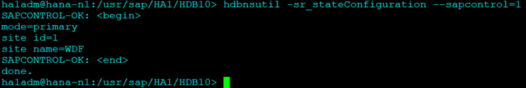

## **SETUP 2 NODE HANA CLUSTER WITH REPLICATION AND HA**

[TOC]

### **Assumptions and Definitions**


### **System Setup**

#### Pre-Requisites

- SLES for SAP installed with below mentioned partitions on 2 nodes.
- Iscsi server has been configured and a 2 GB disk shared as Iscsi targets on both nodes for SBD.
- multipath configured and alias for Iscsi disk set properly for consistency.
- Required Local Partitions:
  - /hana/data      | 50G
  - /hana/shared | 20G
  -  /hana/log        | 50G
  -  /usr/sap          |10 G
  - Optional: NFS Partition
     /data                | NFS partition containing install directory mounted on both nodes. (Optional – Only for Data transfer convenience)
  - iSCSI partition for SBD:
    SDC is from iSCSI for HA

 

  


### **SAP Installation**

#### Download and unzip files

The installation files are kept on the /data as below:

 

Extract the file 51057281.ZIP using below command

```bash
cd /data
mkdir sap_inst
unzip 51057281.ZIP sap_inst/
```

 The zip file is downloaded from SAP Download Center.

Internal team can download from here.

#### Start Installation

##### Node 1

Navigate to HDB_SERVER_LINUX_X86_64 directory and execute hdblcm binary to start the installation

```bash
cd sap_inst/DATA_UNITS/HDB_SERVER_LINUX_X86_64
./hdblcm
```

 

- Select Option 1 to start install

 

- Select 2 for components.
- Keep defaults where ever mentioned.

 

- For System Usage Select Production. Option 1.
-  It will not affect the resource consumption, so you can select any.
-  Select No for Encryption
-  Enter Passwords as required.
-  For DB Password it should have 1 upper case.
-  Post the reboot option it will give you a summary as below

 

If all is good select yes.
 Once finished you should get the below output:

 

##### Node 2

Once installation is finished repeat the same steps on Node 2 with same SID and Instance Number as on Node 1


#### Setting up Replication

Reference: Follow the official documentation starting from Point No.7

On Node 1: Login with ha1adm user and Backup the Database:

```bash
su - ha1adm
hdbsql -i 10 -u SYSTEM -d SYSTEMDB "BACKUP DATA FOR FULL SYSTEM USING FILE ('backup')"
```

 

Enable the Primary Node "node 1":

```bash
hdbnsutil -sr_enable --name=WDF
```

 

Check SR on Node 1

```bash
hdbnsutil -sr_stateConfiguration --sapcontrol=1
```

 

On the Second Node stop the Hana DB: 

```bash
HDB stop
```

 

Copy the KEY and KEY-DATA file from the primary to the secondary site:

On Node2:

```bash
cd /usr/sap/HA1/SYS/global/security/rsecssfs/
scp 192.168.211.42:/usr/sap/HA1/SYS/global/security/rsecssfs/data/SSFS_HA1.DAT data/
scp 192.168.211.42:/usr/sap/HA1/SYS/global/security/rsecssfs/key/SSFS_HA1.KEY key/ 
```

 

Now Register the second Node: 

```bash
hdbnsutil -sr_register --name=ROT --remoteHost=hana-n1 --remoteInstance=10 --replicationMode=sync --operationMode=logreplay
```

 

Start Secondary and Check SR Configuration

```bash
HDB start
```

 

Check Replication Status

```bash
hdbnsutil -sr_stateConfiguration --sapcontrol=1
```

 

Note that the mode is “SYNC”
 Further details on replication can be found using the script hdbsettings:

```bash
HDBSettings.sh systemReplicationStatus.py --sapcontrol=1
```


#### Configuring Replication, Takeover, checksrv hooks and ha1adm user access to cluster

Follow the below step in Both Nodes.

Edit the global.ini file and enter the below parameters

```
vim /hana/shared/HA1/global/hdb/custom/config/global.in

[ha_dr_provider_saphanasr]
provider = SAPHanaSR
path = /usr/share/SAPHanaSR/
execution_order = 1

[trace]
ha_dr_saphanasr = info

[ha_dr_provider_sustkover]
provider = susTkOver
path = /usr/share/SAPHanaSR/
execution_order = 2

[trace]
ha_dr_sustkover = info

[ha_dr_provider_suschksrv]
provider = susChkSrv
path = /usr/share/SAPHanaSR/
execution_order = 3
action_on_lost=stop

[trace]
ha_dr_suschksrv = info

```

Also make sure the [system_replication] section has the operation mode parameter defined as logreplay

```
[system_replication]
mode = primary
actual_mode = primary
site_id = 1
site_name = WDF
operation_mode = logreplay
```

The file should look like this:

On Node1:

 

On Node 2:

 

Configure ha1adm user access to cluster on both nodes:

Create a new file SAPHanaSR  in suders.d and add the below content:

```bash
vim /etc/sudoers.d/SAPHanaSR
# SAPHanaSR-ScaleUp entries for writing srHook cluster attribute and SAPHanaSR-hookHelper
ha1adm ALL=(ALL) NOPASSWD: /usr/sbin/crm_attribute -n hana_ha1_site_srHook_*
ha1adm ALL=(ALL) NOPASSWD: /usr/sbin/SAPHanaSR-hookHelper *
```

Check the newly configured hooks:

Start HANA in both server using below command:

```
HDB start
```

Once started check the hooks are loaded properly using cdtrace

```bash
cdtrace
grep HADR.*load.*SAPHanaSR nameserver_*.trc
grep SAPHanaSR.init nameserver_*.trc
grep HADR.*load.*susTkOver nameserver_*.trc
grep susTkOver.init nameserver_*.trc
grep HADR.*load.*susChkSrv nameserver_*.trc
grep susChkSrv.init nameserver_*.trc
egrep '(LOST:|STOP:|START:|DOWN:|init|load|fail)' nameserver_suschksrv.trc
grep SAPHanaSR.srConnection.*CRM nameserver_*.trc
grep SAPHanaSR.srConnection.*fallback nameserver_*.trc
```

 


### **Setup High Availability**

To setup ha please have SBD configured on both nodes.

For this setup I have used multipath for consistency.

#### Configure Multipath

First make sure you have an Iscsi server which exposes a device of 2 GB as Iscsi target.

In both nodes make sure Iscsi client is configured and connected.

Refer the official guide for help [here](https://documentation.suse.com/sle-ha/15-SP5/html/SLE-HA-all/ha-iscsi-for-sbd.html):

You should be able to see the device in 

```
fdisk -l
```

Next install multipath if not already installed

```
zypper install multipath*
```

Start and enable multipathd.service.

```
systemctl enable multipathd.service
systemctl start multipathd.service
```

Start and enable chronyd.service.

```
systemctl enable chronyd.service
systemctl start chronyd.service
```

Generate the multipath configuration file using the command

```
multipath -T >/etc/multipath.conf
```

This command should automatically configure multipath for the sbd device, however alias won’t be added.
Edit the multipath.conf file and add the alias for the device.

 

Reload multipath:

```
service multipathd reload
```

New device should be available in fdisk -l 

 

This is the device we will use in HA configuration.

Repeat the steps on Node 2

#### HA installation

Initiate HA installation on Node1

```
ha-cluster-init -U -s /dev/mapper/mpath-sbd
```

**Answer “No” for VIP and QDevice.**

 

Some commands to check if SBD has been configured correctly:

```
egrep -v "(^#|^$)" /etc/sysconfig/sbd
sbd -d /dev/mapper/mpath-sbd dump
sbd -d /dev/mapper/mpath-sbd list
```

On second Node to join this cluster:

```
ha-cluster-join -c 192.168.211.42
```

 

To check the cluster: (On both nodes):

```
systemctl status pacemaker
systemctl status sbd
crm cluster start
crm status
```

 

#### SAP Cluster Configuration

Now that the initial cluster is setup lets configure SAP HANA multistate using separate configuration files and loading it into cluster.

The syntax would be as below:

```
vi crm-fileXX
crm configure load update crm-fileXX
```

1. **Cluster bootstrap**

   ```
   vi crm-bs.txt
   ###
   # enter the following to crm-bs.txt
   property cib-bootstrap-options: \
       stonith-enabled="true" \
       stonith-action="reboot" \
       stonith-timeout="150" \
       priority-fencing-delay="30"
   rsc_defaults rsc-options: \
       resource-stickiness="1000" \
       migration-threshold="5000"
   op_defaults op-options: \
       timeout="600" \
       record-pending=true
   ```

   Load config to cluster:

   ```
   crm configure load update crm-bs.txt
   ```

2. **STONITH device**

   ```
   vi crm-sbd.txt
   ###
   # enter the following to crm-sbd.txt
   primitive stonith-sbd stonith:external/sbd \
       params pcmk_delay_max="15"
   ```

   Load config to cluster:

   ```
   crm configure load update crm-sbd.txt
   ```

3. **SAPHanaTopology**

   ```
   vi crm-saphanatop.txt
   ###
   # enter the following to crm-saphanatop.txt
   primitive rsc_SAPHanaTop_HA1_HDB10 ocf:suse:SAPHanaTopology \
       op monitor interval="10" timeout="600" \
       op start interval="0" timeout="600" \
       op stop interval="0" timeout="300" \
       params SID="HA1" InstanceNumber="10"
   clone cln_SAPHanaTop_HA1_HDB10 rsc_SAPHanaTop_HA1_HDB10 \
       meta clone-node-max="1" interleave="true"
   ```

   Load config to cluster:

   ```
   crm configure load update crm-saphanatop.txt
   ```

4. **SAPHana**

   ```
   vi crm-saphana.txt
   # enter the following to crm-saphana.txt
   primitive rsc_SAPHana_HA1_HDB10 ocf:suse:SAPHana \
       op start interval="0" timeout="3600" \
       op stop interval="0" timeout="3600" \
       op promote interval="0" timeout="3600" \
       op monitor interval="60" role="Master" timeout="700" \
       op monitor interval="61" role="Slave" timeout="700" \
       params SID="HA1" InstanceNumber="10" PREFER_SITE_TAKEOVER="true" \
           DUPLICATE_PRIMARY_TIMEOUT="7200" AUTOMATED_REGISTER="false" \
       meta priority="100"
   ms msl_SAPHana_HA1_HDB10 rsc_SAPHana_HA1_HDB10 \
       meta clone-max="2" clone-node-max="1" interleave="true" maintenance=true
   ```

   Load config to cluster:

   ```
   crm configure load update crm-saphana.txt
   ```

5. **Virtual IP address**

   ```
   # vi crm-vip.txt
   # enter the following to crm-vip.txt
   primitive rsc_ip_HA1_HDB10 ocf:heartbeat:IPaddr2 \
       op monitor interval="10s" timeout="20s" \
       params ip="192.168.1.20"
   ```

   Load config to cluster:

   ```
   crm configure load update crm-vip.txt
   ```

6. **Activating multi-state resource for cluster operation**

   ```
   crm resource refresh msl_SAPHana_HA1_HDB10
   crm resource maintenance msl_SAPHana_HA1_HDB10 off
   ```

That’s it you successfully configured HANA with replication and HA.

If you go to your HAWK portal, you should see as below:

 

#### Testing

Test 1:

- Stop Hana on node 1

  - ```
    HDB stop
    ```

- Automatic take over should happen and node 2 should be promoted.

- Refresh cluster resource and check status

  - ```
    crm resource refresh rsc_SAPHana_HA1_HDB10 hana-n1
    crm status
    ```

- Node 1 should start and stay as secondary

​	 

To Recover:

```
hdbnsutil -sr_register --name=WDF --remoteHost=hana-n2 --remoteInstance=10 --replicationMode=sync --operationMode=logreplay
```

Test 2:

- Stop Hana on node 2

  - ```
    HDB stop
    ```

- Automatic take over should happen and node 1 should be promoted

   

- To Recover on Node 2

  - ```
    hdbnsutil -sr_register --name=ROT --remoteHost=hana-n1 --remoteInstance=10 --replicationMode=sync --operationMode=logreplay
    ```

- Node 2 should start and stay as secondary

   


**If you are facing issue to start HANA, try clearing constraints in HA console once.**

=============================END OF DOCUMENT==============================
