## Rancher documentation for setting up Rancher on AKS.

https://rancher.com/docs/rancher/v2.6/en/installation/resources/k8s-tutorials/aks/


## 1. Prepare your Workstation

Install the following command line tools on your workstation:

- The Azure CLI, **az:** For help, refer to these [installation steps.](https://docs.microsoft.com/en-us/cli/azure/)
- **kubectl:** For help, refer to these [installation steps.](https://kubernetes.io/docs/tasks/tools/#kubectl)
- **helm:** For help, refer to these [installation steps.](https://helm.sh/docs/intro/install/)

## 2. Create a Resource Group

After installing the CLI, you will need to log in with your Azure account.

```bash
az login
```

Create a [resource group](https://docs.microsoft.com/en-us/azure/azure-resource-manager/management/manage-resource-groups-portal) to hold all relevant resources for your cluster. Use a location that applies to your use case.

```bash
az group create --name tapas-aks-rg2 --location centralindia
```


## 3. Create the AKS Cluster

To create an AKS cluster, run the following command. Use a VM size that applies to your use case. Refer to [this article](https://docs.microsoft.com/en-us/azure/virtual-machines/sizes) for available sizes and options. When choosing a Kubernetes version, be sure to first consult the [support matrix](https://rancher.com/support-matrix/) to find the highest version of Kubernetes that has been validated for your Rancher version.

**Note:** If the version of Kubernetes is updated to v1.22 or later, the version of ingress-nginx would also need to be [updated](https://kubernetes.github.io/ingress-nginx/#faq-migration-to-apiversion-networkingk8siov1).

```bash
az aks create --resource-group tapas-aks-rg2 --name tapas-aks-cls4 --kubernetes-version 1.23.8 --node-count 1 --node-vm-size Standard_B2ms
```

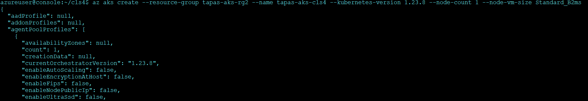

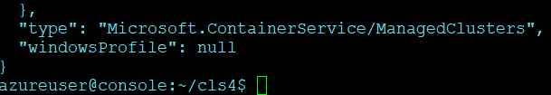 


## 4. Get Access Credentials

After the cluster is deployed, get the access credentials.

```bash
az aks get-credentials --resource-group tapas-aks-rg1 --name tapas-aks-cls2
```

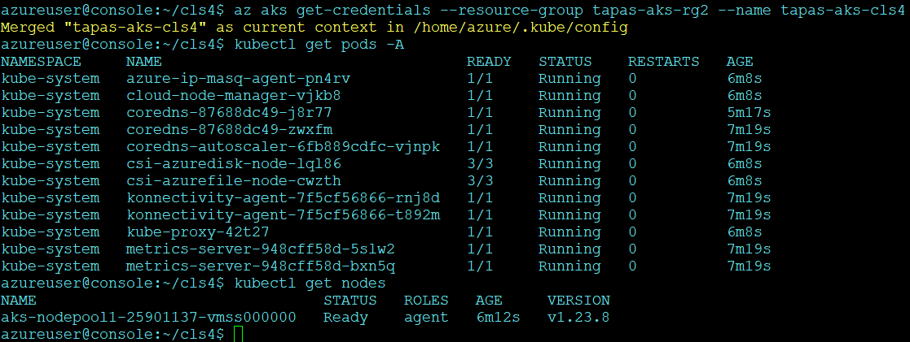

This command merges your cluster’s credentials into the existing kubeconfig and allows `kubectl` to interact with the cluster.

## 5. Install an Ingress

The cluster needs an Ingress so that Rancher can be accessed from  outside the cluster. Installing an Ingress requires allocating a public  IP address. Ensure you have sufficient quota, otherwise it will fail to  assign the IP address. Limits for public IP addresses are applicable at a regional level per subscription.

The following command installs an `nginx-ingress-controller` with a Kubernetes load balancer service.

```bash
helm repo add ingress-nginx https://kubernetes.github.io/ingress-nginx
helm repo update
```

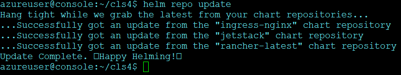 

```bash
helm upgrade --install ingress-nginx ingress-nginx/ingress-nginx --namespace ingress-nginx --set controller.service.type=LoadBalancer --create-namespace
```

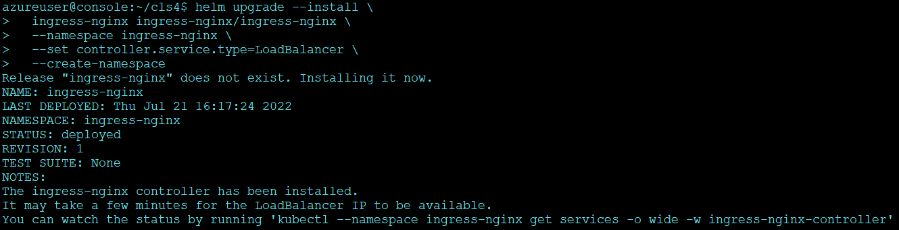

```bash
kubectl get pods -n ingress-nginx
```

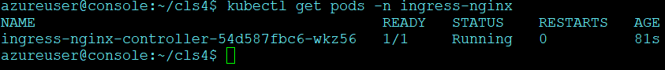 


## 6. Get Load Balancer IP

To get the address of the load balancer, run:

```bash
kubectl get service ingress-nginx-controller --namespace=ingress-nginx
```

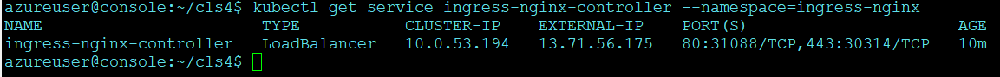

## 7. Set up DNS

External traffic to the Rancher server will need to be directed at the load balancer you created.

Set up a DNS to point at the `EXTERNAL-IP` that you saved. This DNS will be used as the Rancher server URL.

I have done the DNS addition in the Domain registrar level below is the output from `dnswatch.info` showing the resolution is successful on the above received IP address in Ingress.

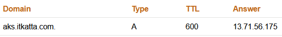 

You can follow the Azure documentation to add this in azure DNS.
[Azure DNS documentation](https://docs.microsoft.com/en-us/azure/dns/)

```bash
helm repo add rancher-latest https://releases.rancher.com/server-charts/latest
```


## 8. Deploying Cert manager & Rancher using Helm

https://rancher.com/docs/rancher/v2.6/en/installation/install-rancher-on-k8s/#install-the-rancher-helm-chart

### 8.1 Adding Repo for Cert manager & Rancher

```bash
helm repo add jetstack https://charts.jetstack.io

helm repo add rancher-latest https://releases.rancher.com/server-charts/latest

helm repo update

helm repo list
```

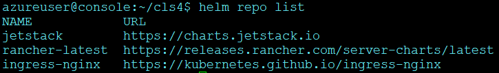 


### 8.2 Install Cert Manager

```bash
helm install cert-manager jetstack/cert-manager --namespace cert-manager --version v1.8.2 --set installCRDs=true --create-namespace
```

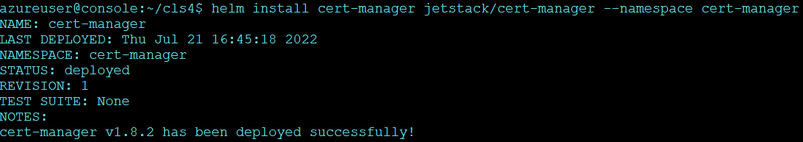 

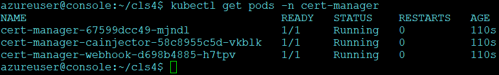 


### 8.3 Deploy Rancher with Lets Encrypt Cert

```bash
helm install rancher rancher-latest/rancher \ 
--namespace cattle-system \
--set hostname=aks.itkatta.com \
--set bootstrapPassword=123456789asdv \
--set ingress.tls.source=letsEncrypt \
--set letsEncrypt.email=email@domain.com \
--set letsEncrypt.ingress.class=nginx \
--create-namespace \
--set replicas=2
```

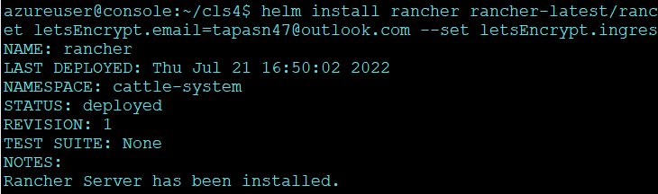 


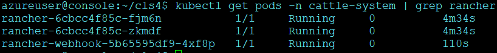 


As you can see the rancher pods are up and running, however accessing rancher URL at this point with fail with `404`
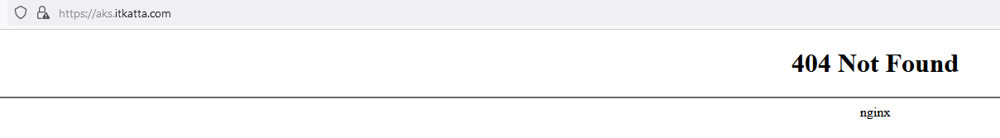
This shows that it crosses LB and hits ingress nginx, but nginx is not able to route traffic to rancher. If we look at the ingress rancher we can see that we are not getting an ingress Address.

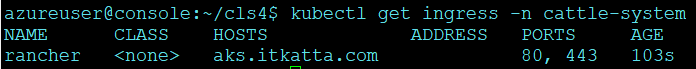 


## 9. Troubleshooting

To mitigate this we need to add an annotation in the ingress as `kubernetes.io/ingress.class: nginx` by editing the ingress "rancher" within namespace "cattle-system"

```bash
kubectl edit ingress rancher -n cattle-system
```

Final ingress annotation should look like below:

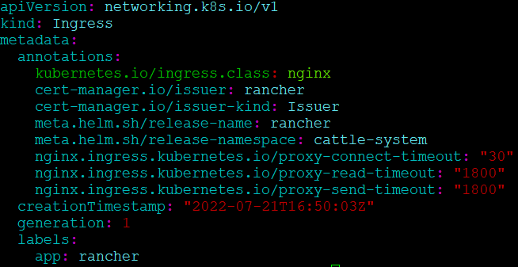 


The added entry is highlighted in yellow.
Post adding the annotation you should see an IP address for the rancher ingress which would be same as your nginx ingress controller IP.

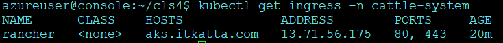 

Post this you will be able to access the rancher server URL.
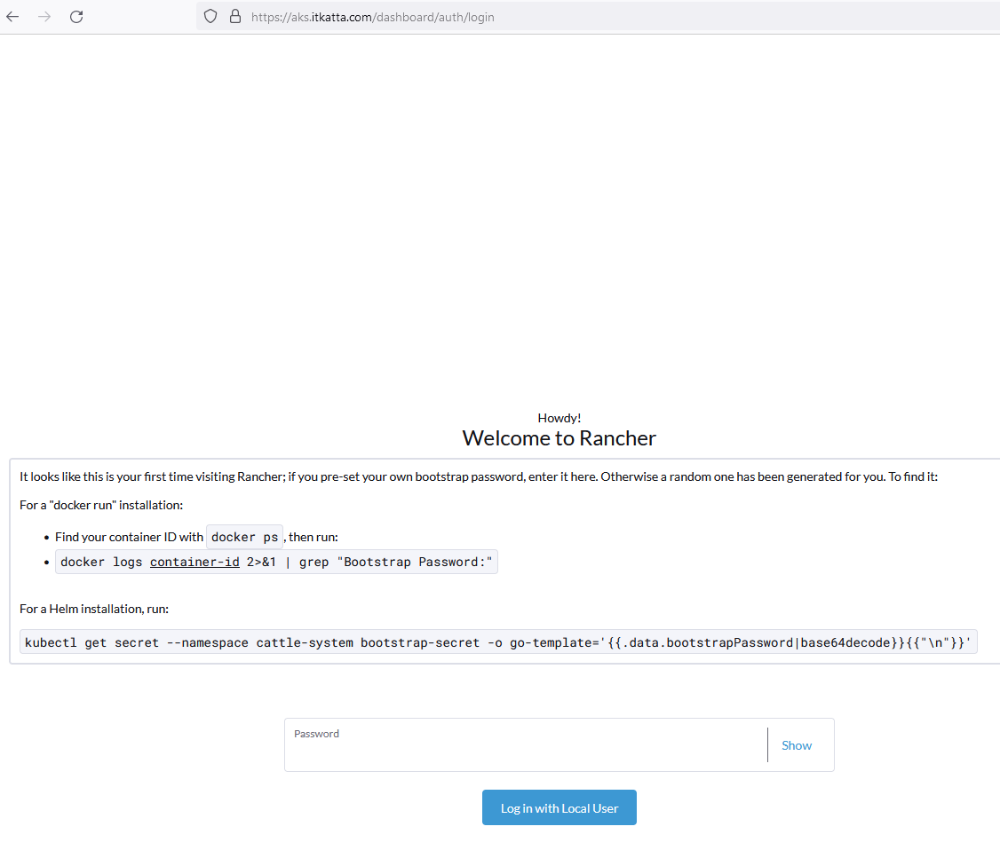 

We will be able to enter the password we created earlier and login to rancher and continue operations as usual.
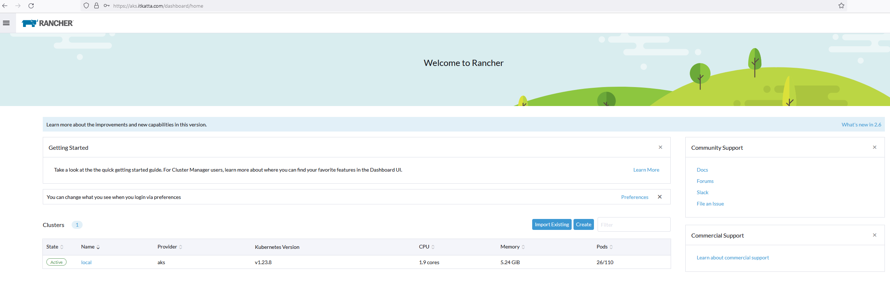 

## Conclusion

We successfully deployed Rancher on AKS Cluster
