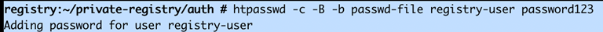
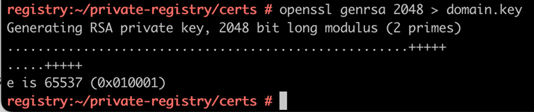
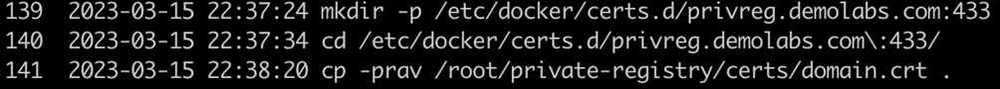
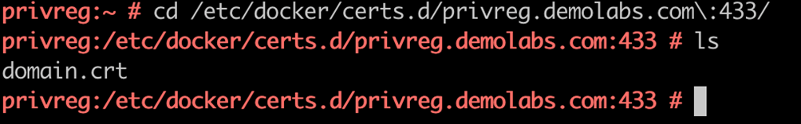
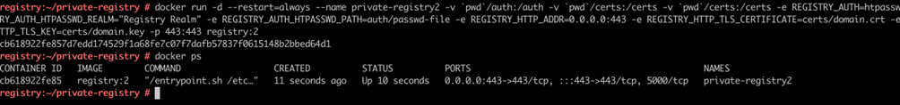
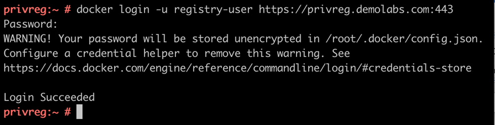

## Setup Private Registry

#### Pre-Requisites:

1. Machine with Docker Installed
2. Approximately 200 GB of Disk Space (Only for RKE2 and Rancher), for any additional application space would be required to be factored accordingly
3. Connection to Internet

#### Steps:

##### Install Package and Dependencies:

###### Install Docker and Apache utils

```bash
zypper -n in docker apache2-utils
```

###### Start and Enable Docker Service

```
systemctl start docker.service && systemctl enable docker.service 
```

###### Setup Authentication

Create Directories for Auth and Certs

```bash
mkdir -p ~/private-registry/auth && mkdir ~/private-registry/certs 
```

Create registry username and password for authentication

```
cd ~/private-registry/certs && htpasswd -c -B -b passwd-file registry-user password123
```

  

Create Self-Signed Certificates

```bash
cd ~/private-registry/certs && openssl genrsa 2048 > domain.key && chmod 400 domain.key
```

 

```bash
openssl req -newkey rsa:4096 -nodes -sha256 -keyout domain.key \ -addext "subjectAltName = DNS:privreg.demolabs.com" -x509 -days 365 -out domain.crt
```

To check authentication via docker you will need to place these files under docker cert directory for that create the certificate directory and copy the ".crt" file.

```bash
mkdir -p /etc/docker/certs.d/privreg.demolabs.com:443
cd /etc/docker/certs.d/privreg.demolabs.com:443
cp -prav /root/private-registry/certs/domain.crt . 
```

 

  

##### Startup Registry Container

```bash
cd /root/private-registry
```

```
docker run -d --restart=always --name private-registry2 \
-v pwd/auth:/auth \ 
-v pwd/certs:/certs \
-e REGISTRY_AUTH=htpasswd \ 
-e REGISTRY_AUTH_HTPASSWD_REALM="Registry Realm" \ 
-e REGISTRY_AUTH_HTPASSWD_PATH=/auth/passwd-file \ 
-e REGISTRY_HTTP_ADDR=0.0.0.0:443 \ 
-e REGISTRY_HTTP_TLS_CERTIFICATE=/certs/domain.crt \ 
-e REGISTRY_HTTP_TLS_KEY=/certs/domain.key -p 443:443 registry:2
```

      

##### Login to Registry and validate

```bash
docker login -u registry-user https://privreg.demolabs.com:443
```

      

#### Conclusion

In the above document we configured private registry

#### Next
[Populate the Private Registry with RKE2 and Rancher Images](./Document-2-Populate-Private-Registry-RKE2&Rancher-Images.md)
