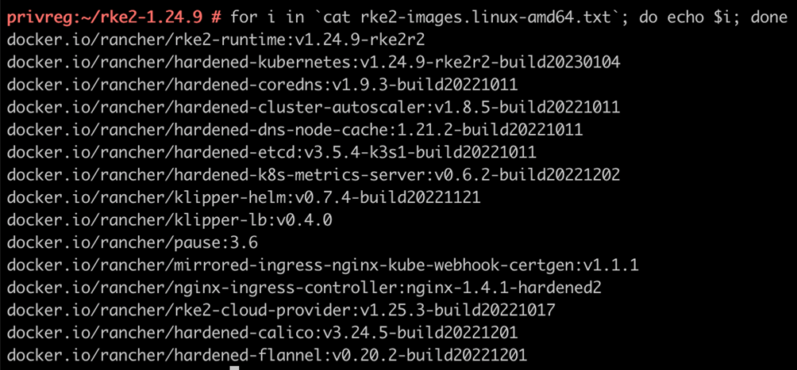
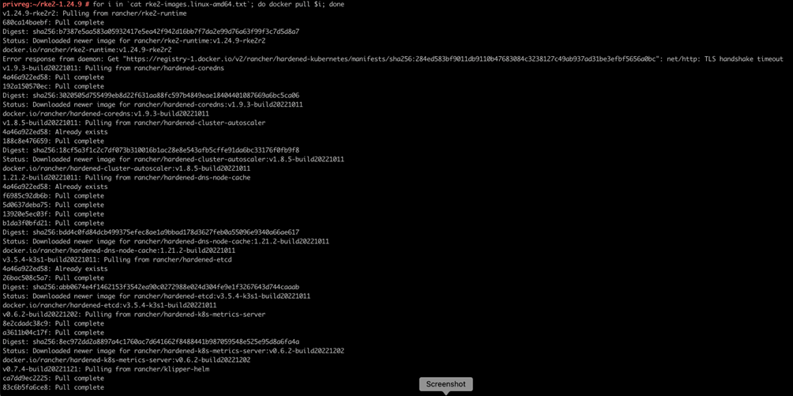
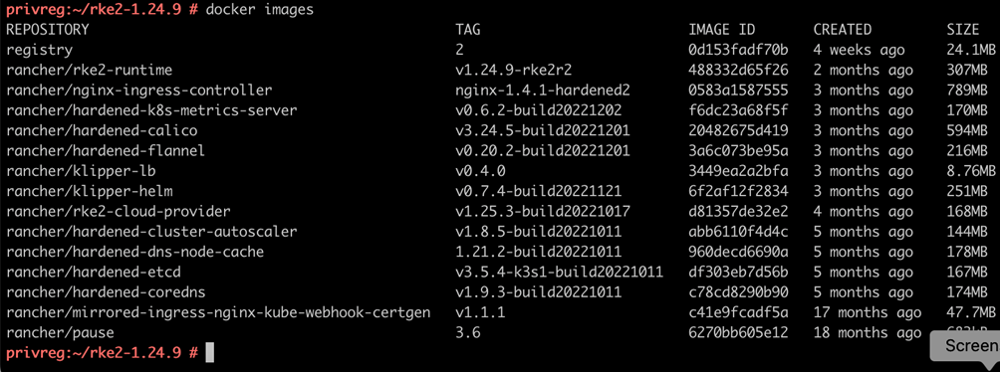
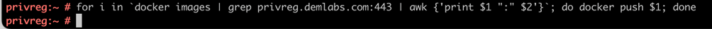

## Configure Private Registry with RKE2 & Rancher Images

#### Pre-Requisites:

Private Registry Setup Successfully - Click [here](./Document-1-Setup-Private-Registry.md) to setup

#### Steps:

##### Setup Private Registry for RKE2

Create a separate Directory for RKE2 Images

```bash
mkdir rke2-1.24.9 && cd rke2-1.24.9
```

Fetch the image list from GitHub release page - For this document we will use the 1.24.9 version

```bash
wget https://github.com/rancher/rke2/releases/download/v1.24.9%2Brke2r2/rke2-images.linux-amd64.txt
```

Check if the contents of the file is in proper format so we can directly pull

```bash
for i in cat rke2-images.linux-amd64.txt; do echo $i; done
```

 

Pull the images

```bash
for i in cat rke2-images.linux-amd64.txt; do docker pull $i; done
```

 

Once the images are pulled check with docker image command

```bash
docker images
```

 

Tag the pulled images with the name of our private registry,  for this we need the Image ID from the docker image command and then we need to add our details in the repository and append the existing tag with version

The Format would be:

```bash
docker tag “image id” privreg.demolabs.com:443/”repository-name:existingtag”
```

ex: 

```bash
docker tag 6fb6fecc3b64 privreg.demolabs.com:443/rancher/rke2-runtime:v1.24.4-rke2r1
```

A small script that would do it for you is as below:

```bash
docker images | grep "^rancher/"|awk '{print "docker tag " $3 " privreg.demolabs.com:443/" $1 ":" $2}' >> imagetotag.sh

chmod +x imagetotag.sh && \#sh -x imagetotag.sh
```

Push the tagged images to your registry

```bash
for i in docker images | grep privreg.demolabs.com:443 | awk {'print $1 ":" $2'}; do docker push $i; done
```

 

Additional Binaries like start stop script,  kubectl and helm also would be needed so download them as well.

```bash
mkdir binaries && cd binaries

wget https://github.com/rancher/rke2/releases/download/v1.24.9%2Brke2r2/rke2.linux-amd64.tar.gz

curl -LO [https://dl.k8s.io/release/$(curl -L -s https://dl.k8s.io/release/stable.txt)/bin/linux/amd64/kubectl](https://dl.k8s.io/release/$(curl -L -s https:/dl.k8s.io/release/stable.txt)/bin/linux/amd64/kubectl)

wget https://get.helm.sh/helm-v3.11.2-linux-amd64.tar.gz
```

**----The above steps conclude the private registry setup for RKE2 below we will setup private registry for Rancher----**

##### Setup Private Registry for RANCHER PRIME

Create a directory for Rancher

```bash
mkdir /root/private-registry/rancher2.7.1 && cd /root/private-registry/rancher2.7.1
```

Download the Rancher Image list

```bash
wget https://github.com/rancher/rancher/releases/download/v2.7.1/rancher-images-digests-linux-amd64.txt
```

Check if the contents of the file is in proper format so we can directly pull

```bash
for i in cat rancher-images-digests-linux-amd64.txt|cut -d " " -f1; do echo $i; done
```

Pull the Images in the list

> Please Note: There are around 400+ Images its going to take time to download them so start the process in screen     To start screen, make sure you have screen installed and then fire "screen -S pull" to detach screen "ctrl + A + D" to reattach "screen -ls" "screen -DDR screen-number.screen-name" to terminate "ctrl+D"

```bash
for i in cat rancher-images-digests-linux-amd64.txt|cut -d " " -f1; do docker pull $i; done
```

Once the images are pulled, you need to tag them

```bash
docker images | grep "^rancher/"|awk '{print "docker tag " $3 " privreg.demolabs.com:443/" $1 ":" $2}' >> imagetotag.sh

chmod +x imagetotag.sh && sh -x imagetotag.sh
```

Push the images in your registry.

```bash
for i in docker images | grep privreg.demolabs.com:443 | awk {'print $1 ":" $2'}; do docker push $i; done
```

##### Setup HELM in your private registry

Install HELM

```bash
curl -fsSL https://raw.githubusercontent.com/helm/helm/master/scripts/get-helm-3 |bash
```

##### Prepare Cert-Manager and Rancher

Create a Directory for helm applications

```bash
mkdir /root/private-registry/helm3 && # cd /root/private-registry/helm3/
```

Add cert manager repo in helm

```bash
helm repo add jetstack https://charts.jetstack.io
```

Fetch and template cert-manager

```bash
helm fetch jetstack/cert-manager --version=v1.7.1

helm template ./cert-manager-v1.7.1.tgz | awk '$1 ~ /image:/ {print $2}' | sed s/\"//g > helm-images.txt
```

Pull the images for cert-manager

```bash
docker pull quay.io/jetstack/cert-manager-cainjector:v1.7.1
docker pull quay.io/jetstack/cert-manager-controller:v1.7.1
docker pull quay.io/jetstack/cert-manager-webhook:v1.7.1
docker pull quay.io/jetstack/cert-manager-ctl:v1.7.1
```

Tag the cert-manager images

```bash
docker images | grep "^quay.io/"|awk '{print "docker tag " $3 " privreg.demolabs.com:443/" $1 ":" $2}' >> imagetotag.sh

chmod +x imagetotag.sh && sh -x imagetotag.sh
```

Check images to push

```bash
for i in docker images | grep privreg.demolabs.com:443 | grep cert-manager | awk {'print $1 ":" $2'}; do echo $i; done
```

Push the images to your private registry

```bash
for i in docker images | grep privreg.demolabs.com:443 | grep cert-manager | awk {'print $1 ":" $2'}; do docker push $i; done
```

Download the cert manager CRD file

```bash
curl -L -o cert-manager/cert-manager-crd.yaml https://github.com/cert-manager/cert-manager/releases/download/v1.7.1/cert-manager.crds.yaml
```

Create Directory for Rancher

```bash
mkdir rancher27 &&  cd rancher27/
```

Add Rancher helm repo and fetch template

```bash
helm repo add rancher-prime https://charts.rancher.com/server-charts/prime

helm fetch rancher-prime/rancher --version=v2.7.1
```

#### Conclusion

In the above document we configured Private Registry for RKE2 and Rancher Images.
