## Setup RKE2 & Rancher Prime in an Airgapped Environment using configured Private Registry & Provision Downstream Cluster

#### Pre-Requisites:

Private Registry Setup Successfully - Click [here](./Document-1-Setup-Private-Registry.md) to setup

Private Registry Populated with RKE2 Images - Click [here](./Document-3-Provision-Airgap-RKE2-Rancher-Downstrstream-Cluster-using-Private-Registry.md) to setup

#### Steps:

### Setup RKE2 in an Airgapped Environment using configured Private Registry

#### Prerequisites

1. Sles 15 SP4 installed, registered and updated
2. Reachability with Private Registry server
3. Containerd installed and service for containerd started and enabled
4. open-iscsi package installed and iscsid.service started and enabled (Only if you wish to use longhorn on this server)
5. apparmor service installed, started and enabled

#### Steps

##### Setup Authentication directories

Create cert directory

```bash
mkdir -p /var/rke2-airgap/certs && cd /var/rke2-airgap/certs
```

Copy Certs and key from Private Registry to RKE2 server 

```bash
scp root@privreg.demolabs.com:/root/private-registry/certs/domain.crt .
scp root@privreg.demolabs.com:/root/private-registry/certs/domain.key .
```

##### Setup Binaries for RKE2

Copy Binary File to /usr/local

```bash
scp root@privreg.demolabs.com:/root/private-registry/rke2-1.24.9/binaries/* /usr/local/
```

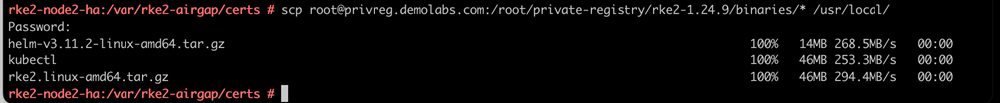   

Untar the file

```
cd /usr/local && tar -xvf rke2.linux-amd64.tar.gz
```

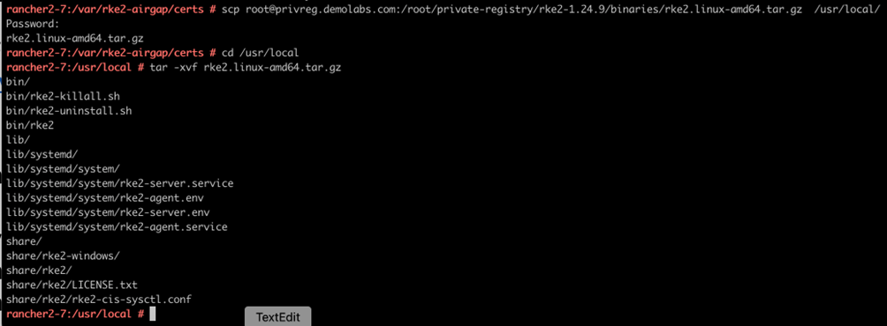 

Copy the services file under systemd and reload

```bash
cp /usr/local/lib/systemd/system/rke2-agent.service /etc/systemd/system/rke2-agent.service
cp /usr/local/lib/systemd/system/rke2-server.service /etc/systemd/system/rke2-server.service
systemctl daemon-reload
```

##### Create Configuration files

Create RKE2 Directory and Registry file

```bash
mkdir -p /etc/rancher/rke2
```

Create the registries.yaml file

```bash
vi /etc/rancher/rke2/registries.yaml
```

```yaml
mirrors:
docker.io:
 endpoint:
    - "https://privreg.demolabs.com:443/v2"
configs:
"privreg.demolabs.com:443":
auth:
  username: registry-user
  password: password123
tls:
  cert_file: /var/rke2-airgap/certs/domain.crt
  key_file: /var/rke2-airgap/certs/domain.key
  insecure_skip_verify: true
```

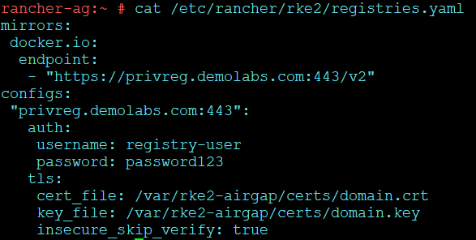 

Create the config.yaml file

```bash
vi /etc/rancher/rke2/config.yaml
```

```yaml
system-default-registry: "privreg.demolabs.com:443"     # private registry fqdn
server: https://192.168.4.205:9345    # Master Node IP. This is required only on  secondary nodes of the cluster
token: token1   # token name for secondary nodes to join#required on all nodes
tls-san:
 - 192.168.4.117   #IP or DNS name for all the servers in HA # Keep adding secondary nodes below
write-kubeconfig-mode: "0644"
```

##### Setup Additional Binaries for Management

Install Kubectl and Helm

```bash
cd /usr/local
tar -zxvf helm-v3.11.2-linux-amd64.tar.gz && mv linux-amd64/helm /usr/local/bin/helm
sudo install -o root -g root -m 0755 kubectl /usr/local/bin/kubectl
```

##### Start RKE2 Cluster and Validate

Enable and Start the RKE2 server service

```bash
systemctl enable rke2-server.service && systemctl start rke2-server.service
```

To check the status of ongoing process

```bash
journalctl -xeu rke2-server.service
```

Create symlink to kube config file

```bash
mkdir -p ~/.kube && ln -s /etc/rancher/rke2/rke2.yaml ~/.kube/config
```

Check and validate nodes and pods

```bash
kubectl get nodes ; kubectl get pods -A
```

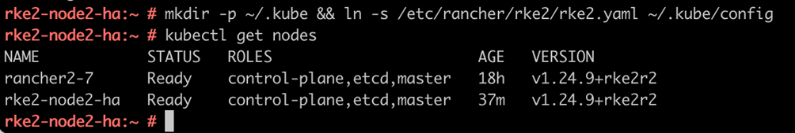 

### Setup Rancher Prime in an Airgapped Environment using configured Private Registry

##### Setup Cert Manager

Create Directories

```bash
mkdir rancher27 && cd rancher27/
mkdir cert-manager && cd cert-manager/
```

Copy the cert-manager CRD file from private registry to the server

```bash
scp -p root@privreg.demolabs.com:/root/private-registry/helm3/cert-manager-crd.yaml .
```

Copy Cert Manager Zip

```bash
scp -p root@privreg.demolabs.com:/root/private-registry/helm3/cert-manager-v1.7.1.tgz .
```

Install Cert-Manager

```bash
kubectl create namespace cert-manager
kubectl apply -f cert-manager-crd.yaml
```

```bash
helm install cert-manager ./cert-manager-v1.7.1.tgz \
--namespace cert-manager \
--set image.repository=privreg.demolabs.com:443/quay.io/jetstack/cert-manager-controller \
--set webhook.image.repository=privreg.demolabs.com:443/quay.io/jetstack/cert-manager-webhook \
--set cainjector.image.repository=privreg.demolabs.com:443/quay.io/jetstack/cert-manager-cainjector \
--set startupapicheck.image.repository=privreg.demolabs.com:443/quay.io/jetstack/cert-manager-ctl
```

##### Setup Rancher

Copy Rancher ZIP

```bash
cd .. && scp -p root@privreg.demolabs.com:/root/private-registry/helm3/rancher27/rancher-2.7.1.tgz .
```

Install Rancher

```bash
kubectl create namespace cattle-system
```

```bash
helm install rancher ./rancher-2.7.1.tgz \
--namespace cattle-system \
--set hostname=rancher-ag.demolabs.com \
--set certmanager.version=1.7.1 \
--set rancherImage=privreg.demolabs.com:443/rancher/rancher \
--set systemDefaultRegistry=privreg.demolabs.com:443 \
--set replicas=3 \
--set bootstrapPassword=passwordpassword@123 \
--set useBundledSystemChart=true
```

### Provision an airgap Downstream Cluster using airgapped Rancher

#### Prerequisites

1. Sles 15 SP4 installed, registered and updated
2. Reachability with Private Registry server and Rancher-Airgap Server
3. Containerd installed and service for containerd started and enabled
4. open-iscsi package installed and iscsid.service started and enabled (Only if you wish to use longhorn on this server)
5. apparmor service installed, started and enabled

#### Create Cluster from Rancher

Under Global Apps click on cluster management

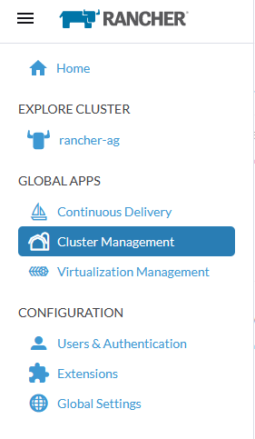 

Click on Create Cluster under Cluster Management

  

Click on Custom option

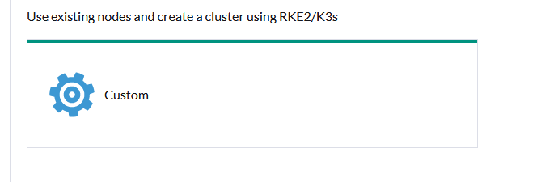 

Fill up the cluster name

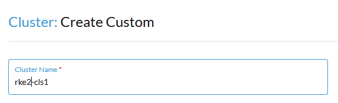 

Select the Kubernetes version

Make sure to select then one which you have updated the in the private registry in this case it is 1.24.9

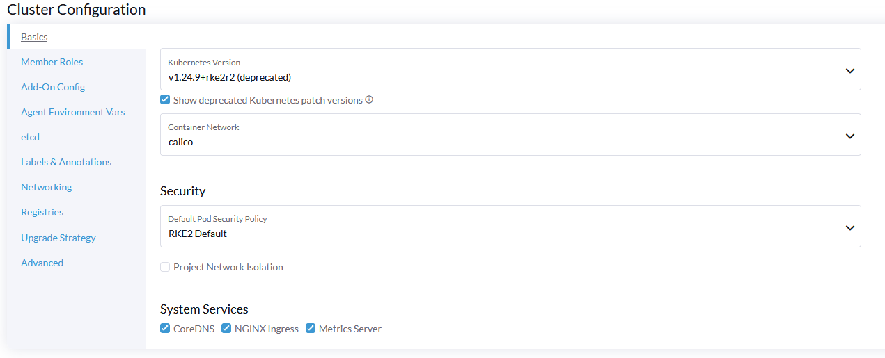 

Under the registries option in the cluster configuration click on advanced registry option

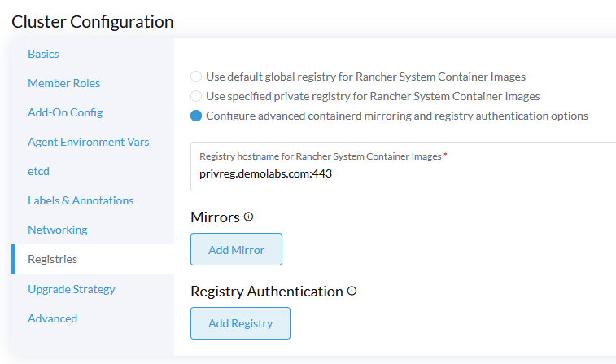 

Fill in the Mirror and the Authentication details, this will be same as registries.yaml configured earlier

> **-> Under Mirror :** 
> 		Registry Hostname: docker.io
>  	   Mirror Endpoints: https://privreg.demolabs.com:443/v2

> **--> Under Registry Authentication:**
>
> ​	    Registry Hostname: privreg.demolabs.com:443
> ​	    TLS Secret: None
> ​        Authentication: Create a HTTP Basic Auth
> ​        Username: Configured username for registry server
> ​	    Password: Password for registry server
> ​	    Tick the Skip TLS verification
>  ​		Ca Cert Bundle: ---> Do cat domain.crt in private registry and enter the certificate contents except the "----Begin Certificate & ---End Certificate Part"

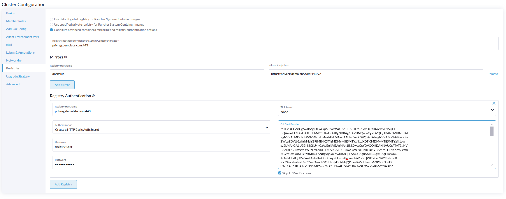

Create Cluster

Once you have filled in the details click on create cluster this should give you the registration command. Make sure to click on insecure before you copy it.

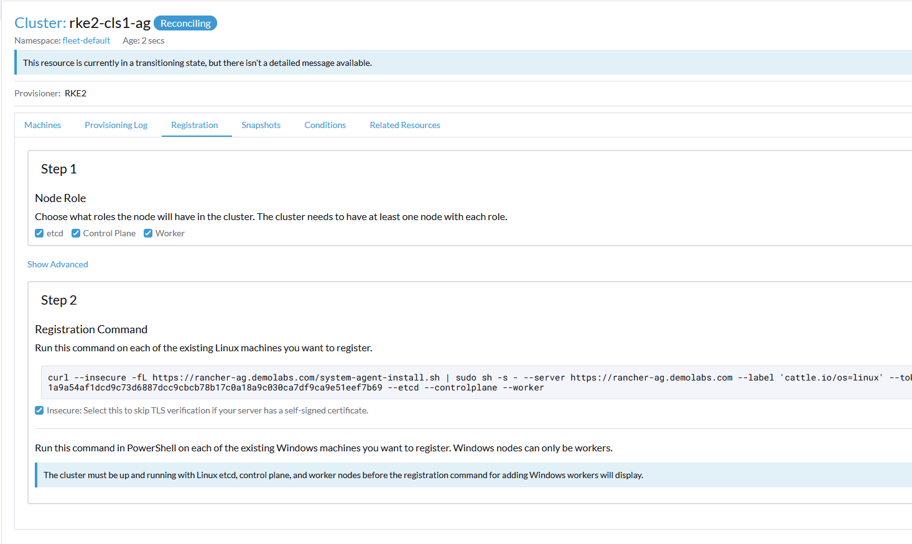 

Copy the command and execute on the server configured for downstream cluster

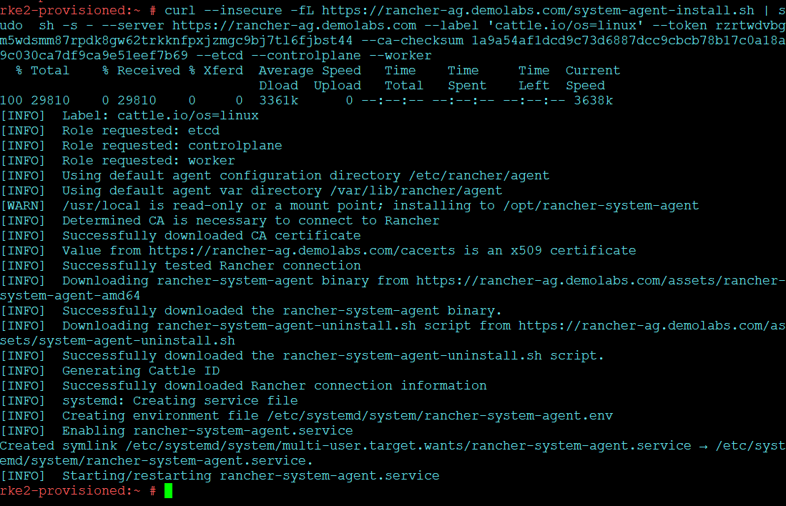

You can check the progress by 

journalctl -f -u rke2-server.service

The cluster should be up and registered under rancher in some time

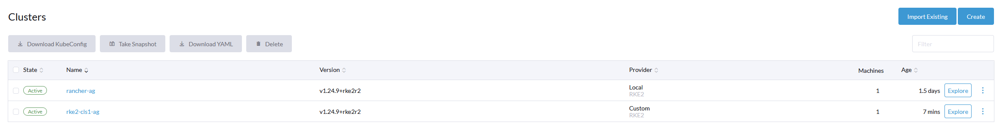 

### Conclusion

In the above document we saw how we can setup private registry and use it to deploy RKE2 cluster, Rancher and then provision a downstream cluster.
