[TOC]

# Harbor Installation with : 

# **- ["Persistent Volume", "Loadbalancer", "Ingress"]**

## Background

In this How to we will deploy Harbor with persistent volume, load balancer, and Ingress. 

The components or pieces used are:

1. OS: SLES 15 SP4 --> Already Installed
2. K8S Distribution: RKE2 "v1.24.9+rke2r2"
3. Storage: We will use local storage with local storage class to make it more generic
4. Loadbalancer: MetalLB
5. Ingress Controller: Nginx

## Step 1: Setup RKE2 without the default ingress

1. Download and execute rke binary: [On Both Nodes]

   ```bash
   sudo bash -c 'curl -sfL https://get.rke2.io | INSTALL_RKE2_CHANNEL="v1.24.9+rke2r2" sh -'
   ```

   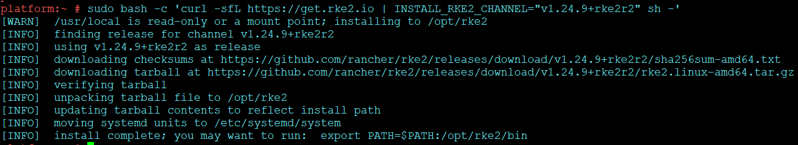 

   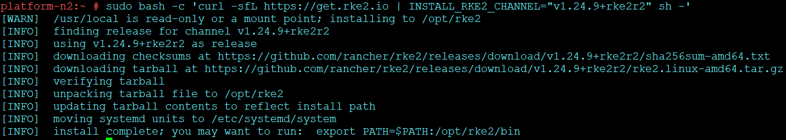 

2. Create the directory and config file [On Master Node]

   ```bash
   sudo mkdir -p /etc/rancher/rke2
   sudo bash -c 'echo "write-kubeconfig-mode: \"0644\"" >> /etc/rancher/rke2/config.yaml'
   sudo bash -c 'echo "disable: ["rke2-ingress-nginx"]" >> /etc/rancher/rke2/config.yaml'
   sudo bash -c 'echo "token: token1" >> /etc/rancher/rke2/config.yaml'
   sudo bash -c 'echo "tls-san: ["192.168.211.193", "192.168.211.194"] " >> /etc/rancher/rke2/config.yaml'
   ```
   
   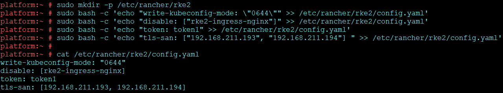 

3.  Create the directory and config file [On Secondary Node/s]

    ```bash
    sudo mkdir -p /etc/rancher/rke2
    sudo bash -c 'echo "server: https://192.168.211.193:9345" >> /etc/rancher/rke2/config.yaml'
    sudo bash -c 'echo "token: token1" >> /etc/rancher/rke2/config.yaml'
    sudo bash -c 'echo "tls-san: ["192.168.211.193", "192.168.211.194"] " >> /etc/rancher/rke2/config.yaml'
    sudo bash -c 'echo "write-kubeconfig-mode: \"0644\"" >> /etc/rancher/rke2/config.yaml'
    sudo bash -c 'echo "disable: ["rke2-ingress-nginx"]" >> /etc/rancher/rke2/config.yaml'
    ```
    
      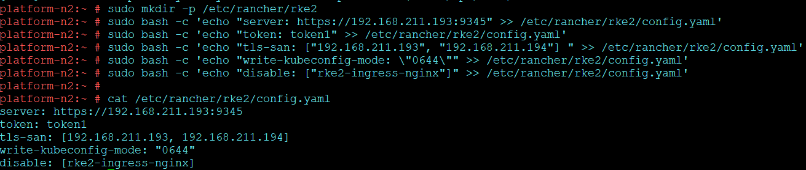
    
4. Enable and start the RKE2 Server Service [On Master Node]
   
   ```bash
   sudo systemctl enable rke2-server.service && sudo systemctl start rke2-server.service 
   ```
   
   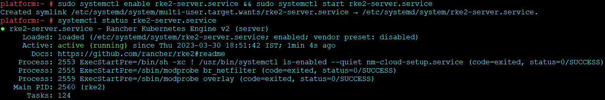 
   
5. Enable and start  RKE2 Agent or Server Service [On Secondary Node/s]

   ```bash
   sudo systemctl enable rke2-agent.service && sudo systemctl start rke2-agent.service
   ```

   OR

   ```bash
   sudo systemctl enable rke2-server.service && sudo systemctl start rke2-server.service
   ```

   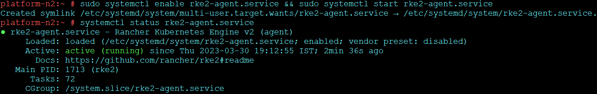 

6. Install Kubectl to interact with cluster

   ```bash
   curl -LO "https://dl.k8s.io/release/$(curl -L -s https://dl.k8s.io/release/stable.txt)/bin/linux/amd64/kubectl" 
   sudo install -o root -g root -m 0755 kubectl /usr/local/bin/kubectl
   ```

   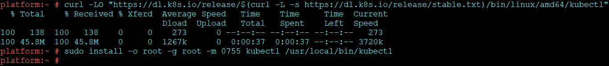 

7. Configure the kube config file

   ```bash
   mkdir -p ~/.kube
   ln -s /etc/rancher/rke2/rke2.yaml ~/.kube/config
   ```

   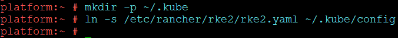 

8. Check status of nodes and pods

   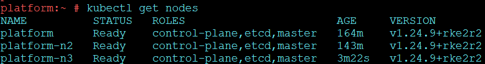 

9. Validate that there is no ingress class.

   ```bash
   kubectl get ingressclass
   ```

   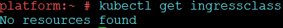 

10. Configure Helm

    ```bash
    curl https://raw.githubusercontent.com/helm/helm/master/scripts/get-helm-3 | bash
    ```
    
    

## Step 2: Deploy default Storage Class

1. Create the storage class yaml

   ```bash
   vim sc.yaml
   ```

   ```yaml
   apiVersion: storage.k8s.io/v1
   kind: StorageClass
   metadata:
     name: local-storage
   provisioner: kubernetes.io/no-provisioner
   volumeBindingMode: WaitForFirstConsumer
   ```

2. Deploy the storage class

   ```bash
   kubectl apply -f sc.yaml
   ```

   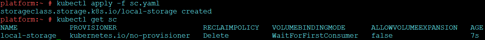
   
   

## Step 3: Deploy MetalLB

1. Create a working Directory and navigate into it

   ```bash
   mkdir /metallb
   cd /metallb
   ```

2. Add helm repo for metallb

   ```bash
   helm repo add metallb metallb/metallb https://metallb.github.io/metallb
   ```

3. Install MetalLB 

   ```bash
   helm install metallb --namespace metallb-system --create-namespace
   ```

   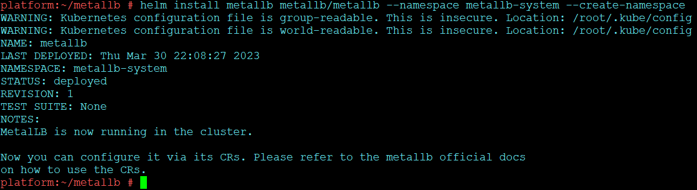 

4. Create IPaddress and Advertisement Files

   ```bash
   vim ipaddresspool.yaml
   ```

   > ```yaml
   > apiVersion: metallb.io/v1beta1
   > kind: IPAddressPool
   > metadata:
   >   name: add-pool
   >   namespace: metallb-system
   > spec:
   >   addresses: ["192.168.211.201-192.168.211.220"]
   > ```

   `vim l2adv.yaml`

   > ```yaml
   > apiVersion: metallb.io/v1beta1
   > kind: L2Advertisement
   > metadata:
   >   name: l2adv
   >   namespace: metallb-system
   > ```

5. Apply the ip address and l2adv yamls just created

   ```bash
   kubectl apply -f ipaddresspool.yaml
   kubectl apply -f l2adv.yaml
   ```

   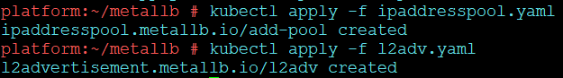 

6. Validate of pods for metallb are up

   ```bash
   kubectl get pods -n metallb-system
   ```
   
   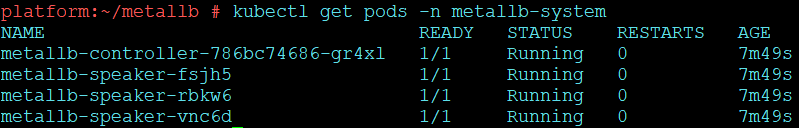 

## Step 4: Deploy Nginx Ingress

1. Install Nginx Ingress via helm

   ```bash
   helm install ingress-nginx ingress-nginx --repo https://kubernetes.github.io/ingress-nginx --namespace ingress-nginx --create-namespace
   ```

   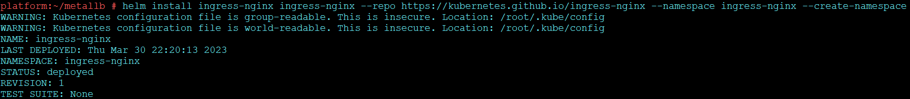 

2. Check Ingress Class and SVC pods related to ingress

   ```bash
   kubectl get ingressclass
   kubectl get svc -A
   ```
   
   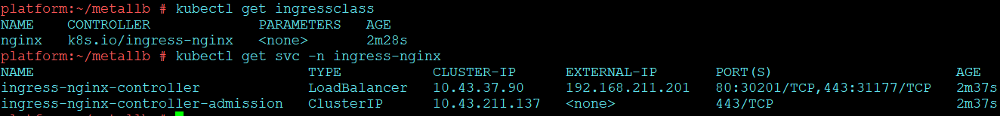 
   
   Note that the Controller got the IP from the MetalLB IP address pool

## Step5: Deploy Harbor

1. Create working directory for Harbor and Navigate into it - **[On All Nodes]**

   ```bash
   mkdir harbor && cd harbor
   ```

   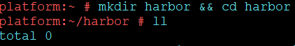 

2. Create certs and the persistent volume directory - **[On All Nodes]**

   ```bash
   mkdir certs && mkdir data
   ```

3. Create sub directories for persistence of various components - **[On All Nodes]**

   ```bash
   cd data && mkdir harbor-data harbor-data-cm harbor-data-js harbor-data-db harbor-data-redis harbor-data-trivy
   ```

   ```bash
   cd ..
   ```

   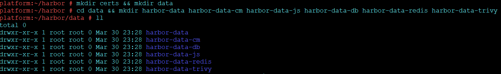 

4. Add harbor helm repo

   ```bash
   helm repo add harbor https://helm.goharbor.io
   ```

   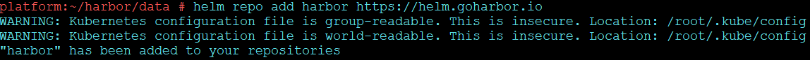 

5. Fetch and Untar the repo so that we can modify the values

   ```bash
   helm fetch harbor/harbor --untar
   ```

   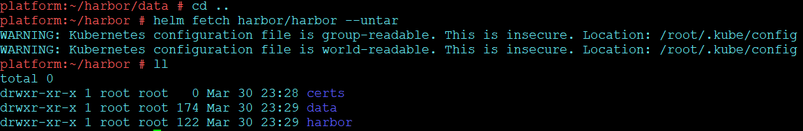

6. Generate Certificates to be used

   Navigate in certs Directory: 

   ```bash
   cd certs
   ```

   Create the key : 

   ```bash
   openssl genrsa -out ca.key 4096
   ```

   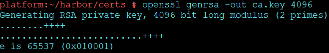 

   Create the cert file: 

   ```bash
   openssl req -x509 -new -nodes -sha512 -days 3650 -subj "/C=IN/ST=MH/L=MUM/O=demolabs/OU=labs/CN=platform.demolabs.com" -key ca.key -out ca.crt
   ```

   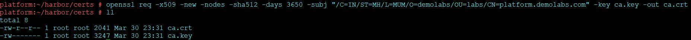 

   Generate the key for domain: 

   ```bash
   openssl genrsa -out platform.demolabs.com.key 4096
   ```

   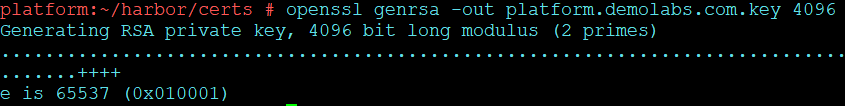 

   Generate CSR for Domain:

   ```bash
   openssl req -sha512 -new -subj "/C=IN/ST=MH/L=MUM/O=demolabs/OU=labs/CN=platform.demolabs.com" -key platform.demolabs.com.key -out platform.demolabs.com.csr
   ```

   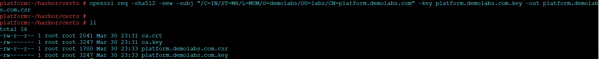 

7. Generate the v3.ext file

   ```bash
   vim v3.ext
   ```

   ```bash
   authorityKeyIdentifier=keyid,issuer
   basicConstraints=CA:FALSE
   keyUsage = digitalSignature, nonRepudiation, keyEncipherment, dataEncipherment
   extendedKeyUsage = serverAuth
   subjectAltName = @alt_names
   [alt_names]
   DNS.1=platform.demolabs.com
   DNS.2=demolabs
   DNS.3=harbor
   DNS.4=notary.platform.demolabs.com
   ```

   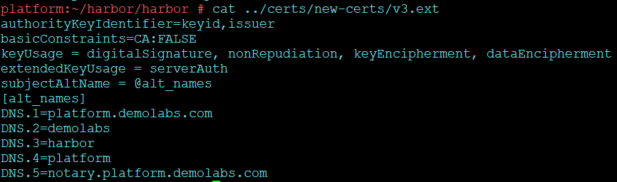 

8. Use the v3.ext created above generate the domain CRT

   ```bash
   openssl x509 -req -sha512 -days 3650 -extfile v3.ext -CA ca.crt -CAkey ca.key -CAcreateserial -in platform.demolabs.com.csr -out platform.demolabs.com.crt
   ```

   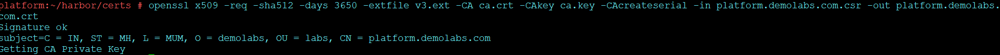 

9. Create Namespace harbor

   ```bash
   kubectl create ns harbor
   ```

10. Create secret in harbor namespace with above generated certificates
11. ```bash
    kubectl create secret tls harbor-cert --key platform.demolabs.com.key --cert platform.demolabs.com.crt -n harbor
    ```
    
    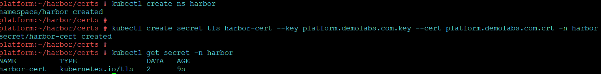 
    
12. Create the Persistent volumes

    ```bash
    cd ../harbor
    vim pv.yaml
    ```

    ```yaml
    apiVersion: v1
    kind: PersistentVolume
    metadata:
      name: harbor-data-pv
      namespace: harbor
    spec:
      capacity:
        storage: 5Gi
      volumeMode: Filesystem
      accessModes:
      - ReadWriteOnce
      persistentVolumeReclaimPolicy: Delete
      storageClassName: local-storage
      local:
        path: /root/harbor/data/harbor-data
      nodeAffinity:
        required:
          nodeSelectorTerms:
          - matchExpressions:
            - key: kubernetes.io/hostname
              operator: In
              values:
              - platform
              - platform-n2
              - platform-n3
    ---
    apiVersion: v1
    kind: PersistentVolume
    metadata:
      name: harbor-data-cm-pv
      namespace: harbor
    spec:
      capacity:
        storage: 5Gi
      volumeMode: Filesystem
      accessModes:
      - ReadWriteOnce
      persistentVolumeReclaimPolicy: Delete
      storageClassName: local-storage
      local:
        path: /root/harbor/data/harbor-data-cm
      nodeAffinity:
        required:
          nodeSelectorTerms:
          - matchExpressions:
            - key: kubernetes.io/hostname
              operator: In
              values:
              - platform
              - platform-n2
              - platform-n3
    ---
    apiVersion: v1
    kind: PersistentVolume
    metadata:
      name: harbor-data-js-pv
      namespace: harbor
    spec:
      capacity:
        storage: 1Gi
      volumeMode: Filesystem
      accessModes:
      - ReadWriteOnce
      persistentVolumeReclaimPolicy: Delete
      storageClassName: local-storage
      local:
        path: /root/harbor/data/harbor-data-js
      nodeAffinity:
        required:
          nodeSelectorTerms:
          - matchExpressions:
            - key: kubernetes.io/hostname
              operator: In
              values:
              - platform
              - platform-n2
              - platform-n3
    ---
    apiVersion: v1
    kind: PersistentVolume
    metadata:
      name: harbor-data-db-pv
      namespace: harbor
    spec:
      capacity:
        storage: 1Gi
      volumeMode: Filesystem
      accessModes:
      - ReadWriteOnce
      persistentVolumeReclaimPolicy: Delete
      storageClassName: local-storage
      local:
        path: /root/harbor/data/harbor-data-db
      nodeAffinity:
        required:
          nodeSelectorTerms:
          - matchExpressions:
            - key: kubernetes.io/hostname
              operator: In
              values:
              - platform
              - platform-n2
              - platform-n3
    ---
    apiVersion: v1
    kind: PersistentVolume
    metadata:
      name: harbor-data-redis-pv
      namespace: harbor
    spec:
      capacity:
        storage: 1Gi
      volumeMode: Filesystem
      accessModes:
      - ReadWriteOnce
      persistentVolumeReclaimPolicy: Delete
      storageClassName: local-storage
      local:
        path: /root/harbor/data/harbor-data-redis
      nodeAffinity:
        required:
          nodeSelectorTerms:
          - matchExpressions:
            - key: kubernetes.io/hostname
              operator: In
              values:
              - platform
              - platform-n2
              - platform-n3
    ---
    apiVersion: v1
    kind: PersistentVolume
    metadata:
      name: harbor-data-trivy-pv
      namespace: harbor
    spec:
      capacity:
        storage: 5Gi
      volumeMode: Filesystem
      accessModes:
      - ReadWriteOnce
      persistentVolumeReclaimPolicy: Delete
      storageClassName: local-storage
      local:
        path: /root/harbor/data/harbor-data-trivy
      nodeAffinity:
        required:
          nodeSelectorTerms:
          - matchExpressions:
            - key: kubernetes.io/hostname
              operator: In
              values:
              - platform
              - platform-n2
              - platform-n3
    ```
    ```bash
    cat pv.yaml
    ```

    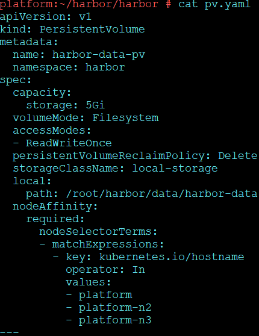 

13. Create Persistent Volume Claims

    ```bash
    vim pvc.yaml
    ```

    ```yaml
    apiVersion: v1
    kind: PersistentVolumeClaim
    metadata:
      name: harbor-data
      namespace: harbor
    spec:
      storageClassName: local-storage
      volumeName: harbor-data-pv
      accessModes:
        - ReadWriteOnce
      volumeMode: Filesystem
      resources:
        requests:
          storage: 5Gi
    ---
    apiVersion: v1
    kind: PersistentVolumeClaim
    metadata:
      name: harbor-data-cm
      namespace: harbor
    spec:
      storageClassName: local-storage
      volumeName: harbor-data-cm-pv
      accessModes:
        - ReadWriteOnce
      volumeMode: Filesystem
      resources:
        requests:
          storage: 5Gi
    ---
    apiVersion: v1
    kind: PersistentVolumeClaim
    metadata:
      name: harbor-data-js
      namespace: harbor
    spec:
      storageClassName: local-storage
      volumeName: harbor-data-js-pv
      accessModes:
        - ReadWriteOnce
      volumeMode: Filesystem
      resources:
        requests:
          storage: 1Gi
    ---
    apiVersion: v1
    kind: PersistentVolumeClaim
    metadata:
      name: harbor-data-db
      namespace: harbor
    spec:
      storageClassName: local-storage
      volumeName: harbor-data-db-pv
      accessModes:
        - ReadWriteOnce
      volumeMode: Filesystem
      resources:
        requests:
          storage: 1Gi
    ---
    apiVersion: v1
    kind: PersistentVolumeClaim
    metadata:
      name: harbor-data-redis
      namespace: harbor
    spec:
      storageClassName: local-storage
      volumeName: harbor-data-redis-pv
      accessModes:
        - ReadWriteOnce
      volumeMode: Filesystem
      resources:
        requests:
          storage: 1Gi
    ---
    apiVersion: v1
    kind: PersistentVolumeClaim
    metadata:
      name: harbor-data-trivy
      namespace: harbor
    spec:
      storageClassName: local-storage
      volumeName: harbor-data-trivy-pv
      accessModes:
        - ReadWriteOnce
      volumeMode: Filesystem
      resources:
        requests:
          storage: 5Gi
    ```

    ```bash
    cat pvc.yaml
    ```

    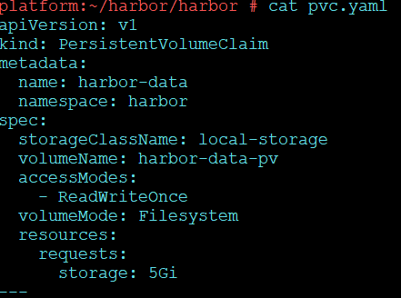 

14. Apply pv and pvc yaml created

    ```bash
    kubectl apply -f pv.yaml
    kubectl apply -f pvc.yaml
    ```

     

14. Modify the values.yaml as below:

    > Line 4: 
    > 	[type: ingress] - [if you need any other service edit it here]

    > 	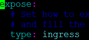 
    >
    > Line 19: 
    > 	[certSource: secret]

    > 	 
    >
    > Line 23:
    > 	[commonName: "platform.demolabs.com"]

    >  	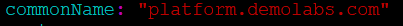 
    >
    > Line 28:
    >  	[secretName: "harbor-cert"]
    >
    > Line 33: 
    > 	[notarySecretName: "harbor-cert"]

    > 	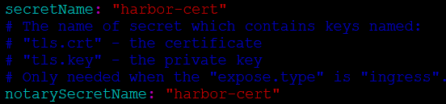 
    >
    > Line 36:
    > 	[core: platform.demolabs.com]
    >
    > Line 37:
    > 	[notary: notary.platform.demolabs.com]

    > 	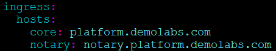 
    >
    > Line 47:
    > 	[className: "nginx"]

    > 	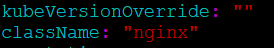 
    >
    > Line 127:
    > 	[externalURL: https://platform.demolabs.com]

    > 	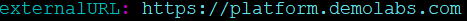 
    >
    > Line 205 - 251
    > 	Add existingClaim: "" and storageClass: "" for each component
    > 	For ex: for harbor-data we have created pvc as "harbor-data" and storage class is "local-storage" so
    > 	 existingClaim: "harbor-data"
    > 	 storageClass: "local-storage"
    > 	Similarly add for [chartmuseum, jobservice, database, redis and trivy] 
    > 	Make sure that the existing claim name matches to the pvc name created above for the components
    > 	Storage Class will remain the same for ALL

    > 	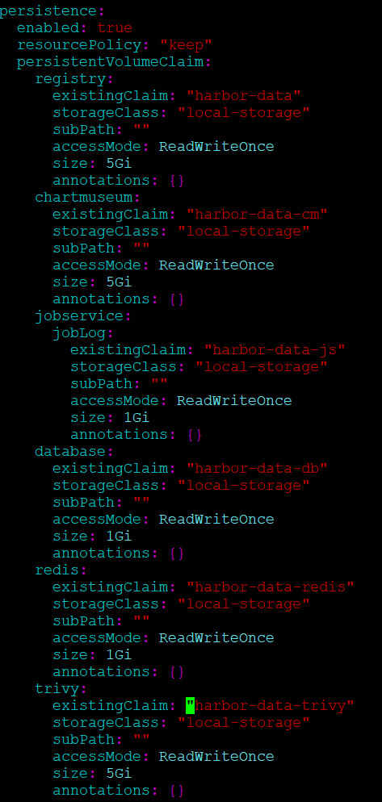
    > 	
    >
    > ```yaml
    > persistence:
    >   enabled: true
    >   resourcePolicy: "keep"
    >   persistentVolumeClaim:
    >     registry:
    >       existingClaim: "harbor-data"
    >       storageClass: "local-storage"
    >       subPath: ""
    >       accessMode: ReadWriteOnce
    >       size: 5Gi
    >       annotations: {}
    >     chartmuseum:
    >       existingClaim: "harbor-data-cm"
    >       storageClass: "local-storage"
    >       subPath: ""
    >       accessMode: ReadWriteOnce
    >       size: 5Gi
    >       annotations: {}
    >     jobservice:
    >       jobLog:
    >         existingClaim: "harbor-data-js"
    >         storageClass: "local-storage"
    >         subPath: ""
    >         accessMode: ReadWriteOnce
    >         size: 1Gi
    >         annotations: {}
    >     database:
    >       existingClaim: "harbor-data-db"
    >       storageClass: "local-storage"
    >       subPath: ""
    >       accessMode: ReadWriteOnce
    >       size: 1Gi
    >       annotations: {}
    >     redis:
    >       existingClaim: "harbor-data-redis"
    >       storageClass: "local-storage"
    >       subPath: ""
    >       accessMode: ReadWriteOnce
    >       size: 1Gi
    >       annotations: {}
    >     trivy:
    >       existingClaim: "harbor-data-trivy"
    >       storageClass: "local-storage"
    >       subPath: ""
    >       accessMode: ReadWriteOnce
    >       size: 5Gi
    >       annotations: {}
    > ```
    >
    > Line 363:
    > 	harborAdminPassword: "Harbor12345"

    > 	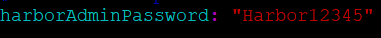 

15. Deploy harbor with the values file
    Make sure you are in the directory where the values.yaml resides
    
    ```bash
    helm install harbor . -n harbor
    ```

    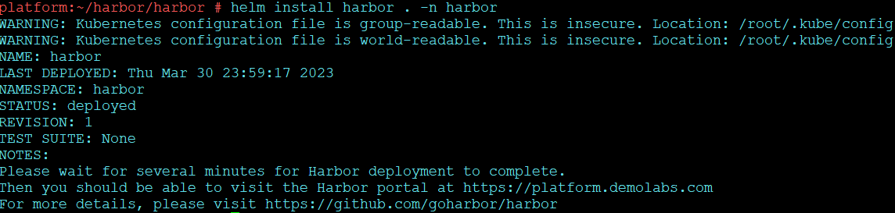 
    
17. Check and wait for pods to come in running state

    ```bash
    kubectl get pods -n harbor -o wide
    ```

    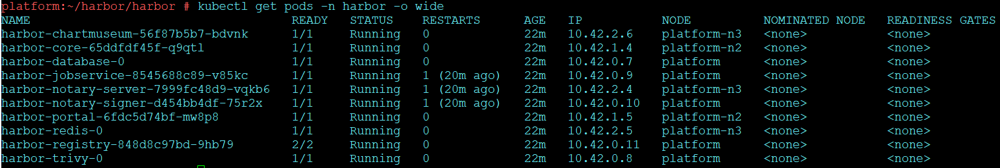 

18. Check for service

    ```bash
    kubectl get svc -n harbor
    ```

    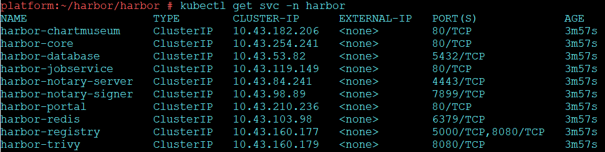 

19. Check for ingress

    ```bash
    kubectl get ingress -n harbor
    ```

    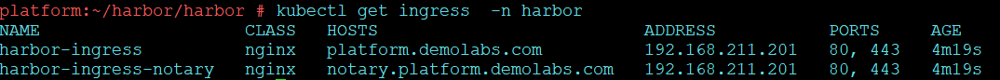 

19. Access the URL https://platform.demolabs.com to check id harbor is up:

    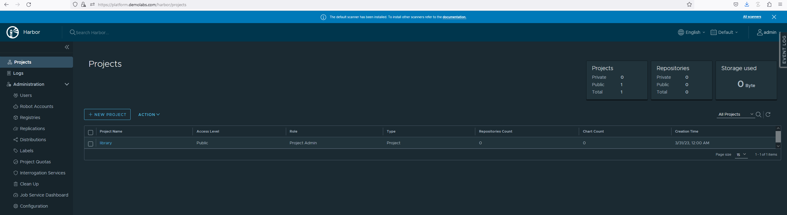 

## Conclusion

We have successfully deployed Harbor in high Availability in RKE2 Kubernetes cluster using Local Storage as storage class, nginx ingress and MetalLB as Load Balancer
